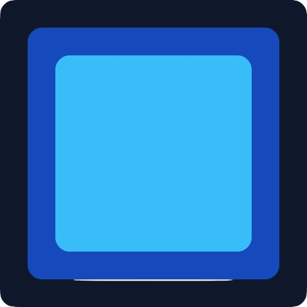
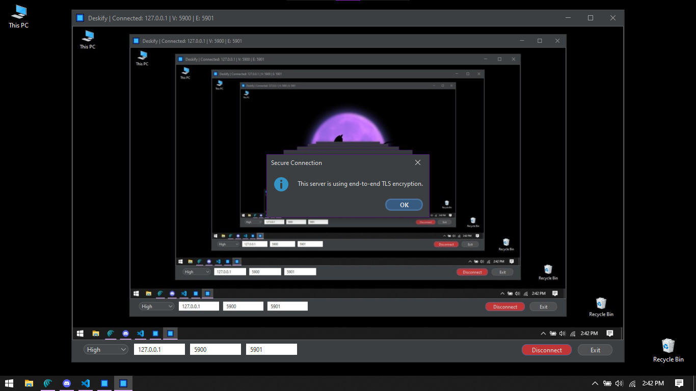
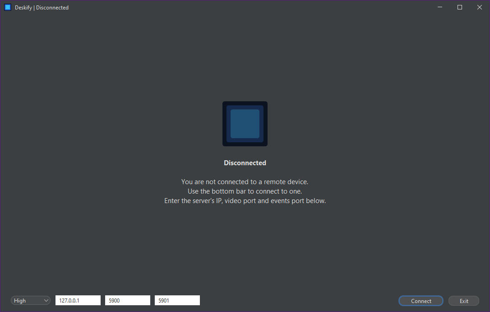
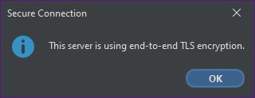
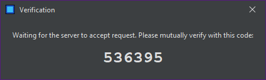
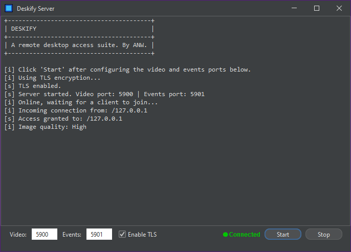
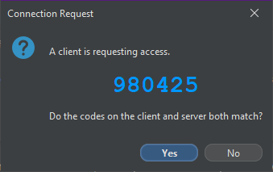

  

# Deskify
A remote control suite to use devices remotely over the Internet.

## Intructions

### How to build
Run `build.bat` or `build.sh`. You must have Java installed along with the JDK.

### How to run
Run `client.bat` or `client.sh` for starting Deskify Client, or `server.bat` or `server.sh` for starting Deskify Server.

## Screenshots

### Client  
  
  
  
  

### Server
  
  

## Credits
© 2026 Deskify by Subhrajit Sain.  
UI Library: [FlatLaf](https://www.formdev.com/flatlaf/)
